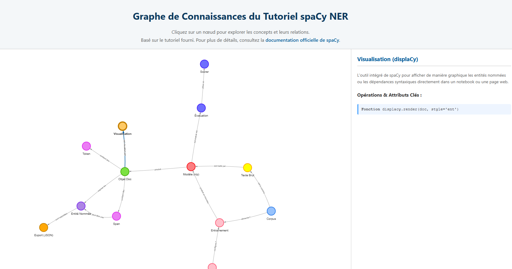

Excellente idée ! C'est une très bonne pratique de créditer la source originale.

J'ai mis à jour le fichier `README.md` pour inclure une section "Source & Crédits" plus visible, avec un lien direct vers le dépôt GitHub du tutoriel de Joseph Chazalon.

Voici la version mise à jour. Vous pouvez la copier-coller pour remplacer votre `README.md` actuel.

---

# Graphe de Connaissances Interactif - Tutoriel spaCy NER

[](https://multibrasservices.github.io/SpaCy/)

Ce projet présente un graphe de connaissances interactif qui visualise les concepts clés et le flux de travail d'un projet de Reconnaissance d'Entités Nommées (NER) avec la bibliothèque Python **spaCy**.

L'objectif est de fournir une vue d'ensemble dynamique et facile à comprendre des relations entre les différents objets et processus, de la lecture du corpus à l'export des résultats.

**[➡️ Accéder à la version live du graphe](https://multibrasservices.github.io/SpaCy/)**

## ✨ Aperçu

*(Pensez à ajouter une capture d'écran de votre page ici pour un meilleur impact visuel !)*

 <!-- Remplacez ce lien par une vraie capture d'écran -->

## 🚀 Fonctionnalités

*   **Visualisation des Concepts** : Les nœuds représentent les concepts fondamentaux comme le `Modèle (nlp)`, l'`Objet Doc`, le `Corpus`, l'`Évaluation`, etc.
*   **Relations Claires** : Les arêtes (flèches) illustrent comment les concepts interagissent (ex: un `Modèle (nlp)` *produit* un `Objet Doc`).
*   **Panneau d'Information Dynamique** : Cliquez sur n'importe quel nœud pour afficher dans le panneau de droite :
    *   Une **description détaillée** de son rôle dans le processus NER.
    *   Les **opérations et attributs clés** en Python associés à ce concept (fonctions, attributs d'objets, etc.).
*   **Groupement par Couleur** : Les nœuds sont regroupés par couleur pour identifier rapidement leur fonction (données source, cœur de spaCy, évaluation, entraînement...).

## 📄 Source & Crédits

Ce graphe est une transposition visuelle du contenu et de la structure du tutoriel **"Initiation à la reconnaissance d'entités nommées avec spaCy"**.

Le cours original, créé par **Joseph Chazalon**, a servi de source principale pour ce projet. Il est vivement recommandé de le consulter pour une compréhension approfondie et pour accéder aux notebooks d'exercices.

➡️ **[Dépôt GitHub du tutoriel original : jchazalon/hn-ariane-ner-tuto-2023](https://github.com/jchazalon/hn-ariane-ner-tuto-2023)**

## 🛠️ Technologies utilisées

*   **HTML5** : Structure de la page.
*   **CSS3** : Style et mise en page.
*   **JavaScript (ES6)** : Logique d'interaction et manipulation des données.
*   **[Vis.js Network](https://visjs.github.io/vis-network/docs/network/)** : La bibliothèque utilisée pour générer et animer le graphe interactif.

## 💻 Utilisation locale

Si vous souhaitez exécuter ce projet sur votre machine :

1.  Clonez le dépôt :
    ```bash
    git clone https://github.com/MultiBrasServices/SpaCy.git
    ```
2.  Naviguez vers le dossier du projet :
    ```bash
    cd SpaCy
    ```
3.  Ouvrez le fichier `index.html` directement dans votre navigateur web.